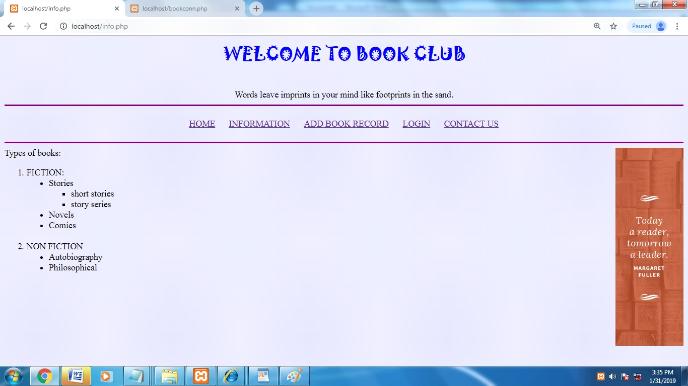
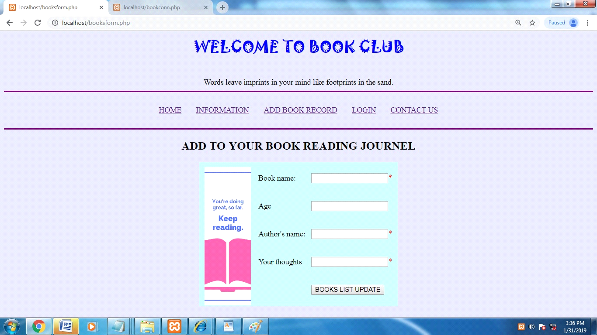
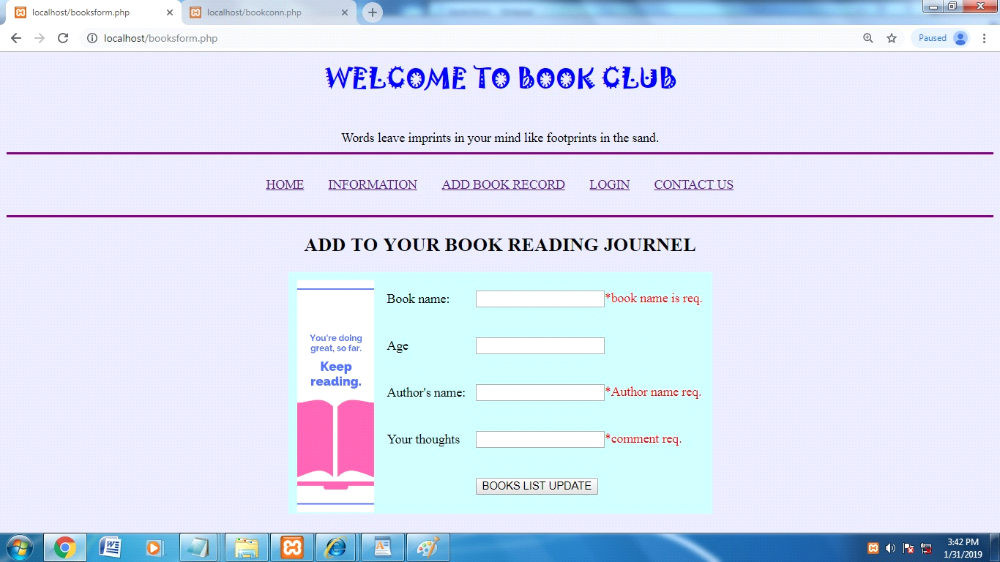
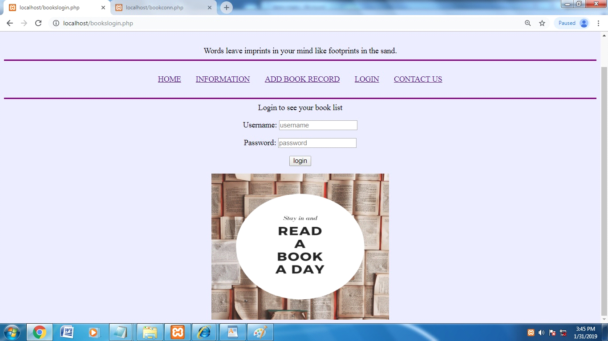
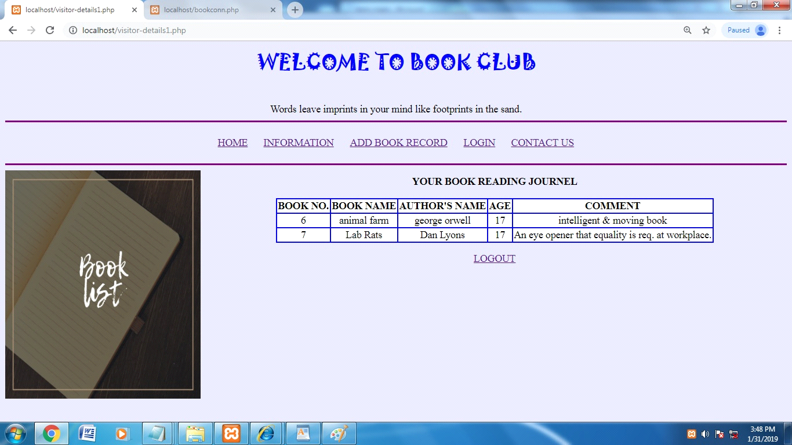
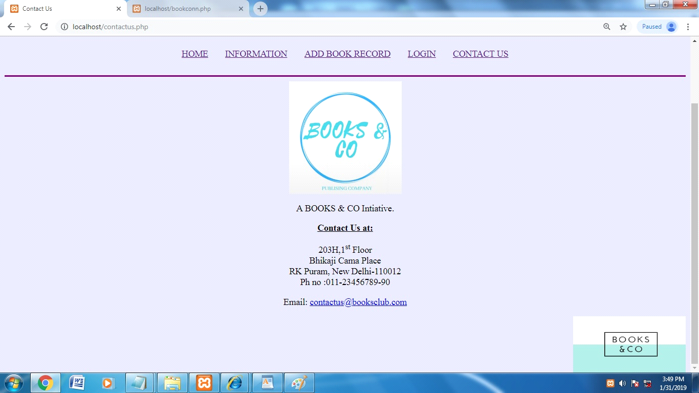

# Book_club
A book club website which lets you login and add data about the books you have read and let's you leave your thoughts about it. My aim was to make a site like our library had in school.
What will you need?
  Notepad and Xampp. Read this >> (if u haven't don't know you how run a php file.)
  <a href="https://www.techjunkie.com/run-php-file-xampp/">How to run php file in Xampp for beginners.</a>
 You will need to copy and paste all the files on your notepad and make sure you Xampp has started. If you get stuck at anything , you can ask me @shweta20011 (Twitter) and I'll help u out.
 
 Below are the files you should be able to see on your window when your code runs.
 
 
 
  
 
 
 
 
 
  
 
 
 
